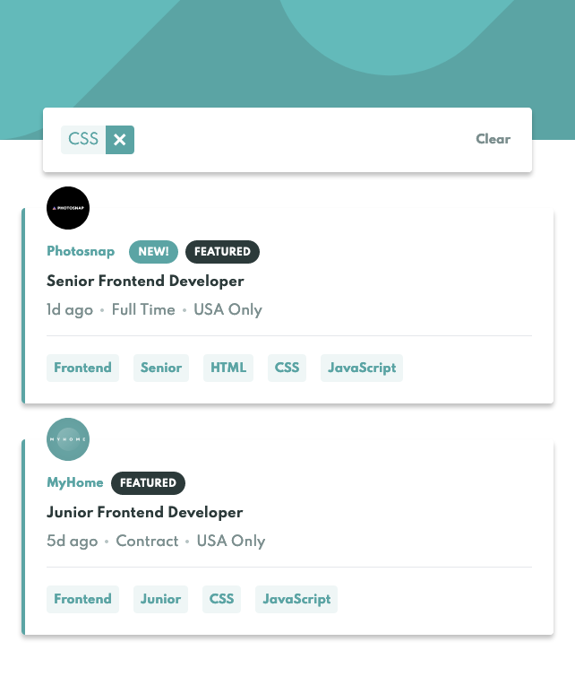
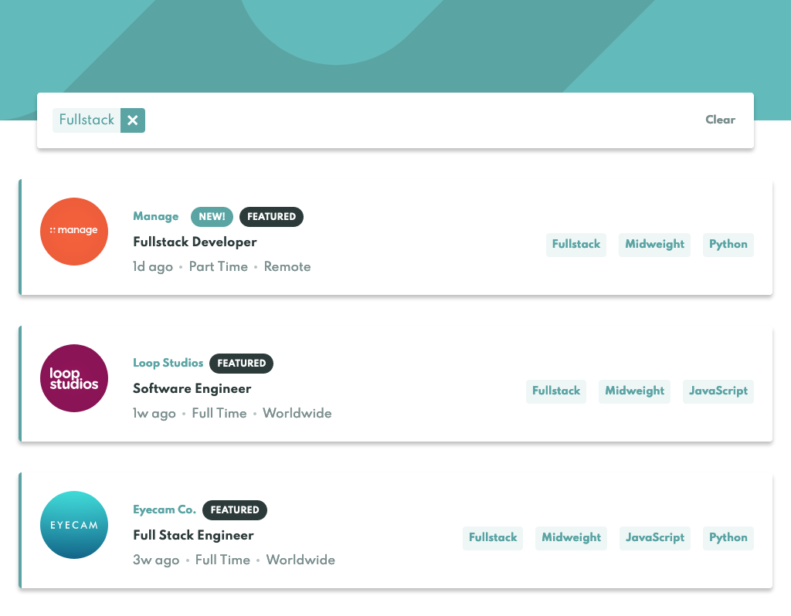

# Frontend Mentor - Job listings with filtering solution

This is a solution to the [Job listings with filtering challenge on Frontend Mentor](https://www.frontendmentor.io/challenges/job-listings-with-filtering-ivstIPCt). Frontend Mentor challenges help you improve your coding skills by building realistic projects.

## Table of contents

- [Overview](#overview)
    - [The challenge](#the-challenge)
    - [Screenshot](#screenshot)
    - [Links](#links)
- [My process](#my-process)
    - [Built with](#built-with)
    - [What I learned](#what-i-learned)
      - [CSS - Flexbox to vertically align and stretch content](#css---flexbox-to-vertically-align-and-stretch-content)
      - [CSS - Flexbox gap is not highly supported](#css---flexbox-gap-is-not-highly-supported)
      - [CSS - Multiple box-shadows are created with commas](#css---multiple-box-shadows-are-created-with-commas)
      - [CSS - Box Shadows vs Drop Shadows](#css---box-shadows-vs-drop-shadows)
      - [ReactJS - Conditional rendering](#reactjs---conditional-rendering)
      - [JS - Set does not store duplicates](#js---set-does-not-store-duplicates)
      - [JS - Modern JS array methods](#js---modern-js-array-methods)
    - [Useful resources](#useful-resources)
- [Author](#author)

## Overview

### The challenge

Users should be able to:

- View the optimal layout for the site depending on their device's screen size
- See hover states for all interactive elements on the page
- Filter job listings based on the categories

### Screenshot

#### Mobile application


#### Desktop application


### Links

- Solution URL: [notapatch@Github](https://github.com/notapatch/job_listings_with_filtering)
- Live Site URL: [job-listings@vercel.com](https://job-listings-with-filtering-gamma.vercel.app/)

## My process

### Built with

- Semantic HTML5 markup
- CSS custom properties
- Flexbox
- CSS Grid
- Mobile-first workflow
- [React](https://reactjs.org/) - JS library
- [Tailwindcss](https://tailwindcss.com/docs) - For styles

### What I learned

#### CSS - flexbox to vertically align and stretch content

When it was stretched the content of the flex-item was "start". Changing it to `self-center` fixed the issue

```jsx
  <div className="flex items-stretch ...  rounded-l">
    <div className="self-center ...">
      Frontend
    </div>
    <div className="bg-icon-remove w-8 ... rounded-r">

    </div>
  </div>
```


I left a mystery with the rounding working only on the outer div on the left-hand side.
The right hand rounding had to happen on the inner div.

#### CSS - Flexbox gap is not highly supported

CSS flexbox wrap be default does not have gutter space between lines. Rows can be spaced using the gap property which only has an [88% global usage](https://caniuse.com/flexbox-gap).
[There are other work around solutions but they have trade offs.](https://stackoverflow.com/questions/20626685/better-way-to-set-distance-between-flexbox-items)
[MDN Creating gutters between items](https://developer.mozilla.org/en-US/docs/Web/CSS/CSS_Flexible_Box_Layout/Mastering_Wrapping_of_Flex_Items#creating_gutters_between_items)

#### CSS - Multiple box-shadows are created with commas

You can want multiple shadows around a box and inside.
[MDN Box Shadow](https://developer.mozilla.org/en-US/docs/Web/CSS/box-shadow)

#### CSS - Box Shadows vs Drop Shadows

Box shadows are, unsurprisingly, for boxes. They aren't as good for none-rectangular shapes and are less convincing on rounded corners.
Unconventional web shapes are better handled by Drop shadow.

Figma has details of shadow in Design panel under "Effects".

[Breaking down CSS Box Shadow vs. Drop Shadow](https://css-tricks.com/breaking-css-box-shadow-vs-drop-shadow/)

#### ReactJS - Conditional rendering

Wanted to have a UI badge appear or not depending on a boolean variable, featured, in the data.json.
[React docs cover conditional rendering so I followed that](https://reactjs.org/docs/conditional-rendering.html).

##### Example of badges New and Featured


In the below example the `BadgeFeatured` is rendered or not depending on the featured boolean.

```jsx
const JobCard = ({knew, featured}) => {
  let featuredBadge
  if (featured) {
    featuredBadge = <BadgeFeatured/>
  }
  
  return(
    ...
    {featuredBadge}
    ...
  )
```

#### ReactJS - Reading data

I'm still having problems reading in images - not a major issue as in a "real" project images would be hosted on S3, for example.
Anyway... Last time I used require this time I found someone's solution (apologies for not remembering the name for acknowledgement):
- altered data.json to data.js - allowing you to add import statements
- import default image "bindings"
- bindings added to data set and used in application to load the images

```jsx
import photosnap from "../images/photosnap.svg";

export const data = [
{
"id": 1,
"company": "Photosnap",
"logo": photosnap,
"new": true,
...
}
```

#### JS - Set does not store duplicates

I wanted to have an array with no unique items. Set requires that there are no duplicates. 
Often this is solved by checking each item before allowing it to be added to the array. I like
this way because there's no branching logic so all code has to flow through the same lines.

```jsx
function handleAddFilter(jobFilter) {
  setFilterList(oldFilterList => [...new Set([...oldFilterList, jobFilter])])
}
```


#### JS - Modern JS array methods

It's a pleasure to work with the modern JavaScript array functions it has the same feel as Ruby.
An example is filtering the set of jobs by comparing that an array of filters has `every` filter
present in the properties of the job items.

```jsx
const filteredJobs = jobs.filter( job => {
  return (
    filterList.every(filter => [job.role, job.level, ...job.languages].includes(filter))
  )
})
```

### Useful resources

[React docs still solves more than half of my problems.](https://reactjs.org/docs/getting-started.html)

## Author

- Frontend Mentor - [@notapatch](https://www.frontendmentor.io/profile/notapatch)
- Twitter - [@notapatch](https://twitter.com/notapatch)

## Acknowledgement

@AlexKMarshall - thank you for reviewing my newbie React code.